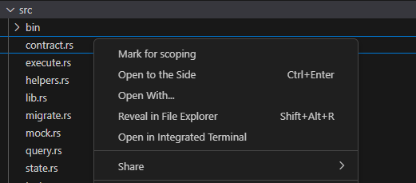
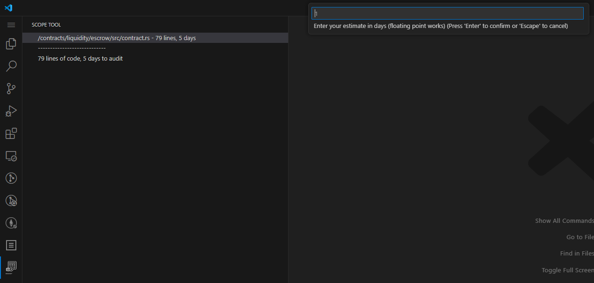

# scope-tool

## Features

- Right click files in your workspace and choose the `Mark for Scoping` option.
- Use the new `Scope Tool` panel on the activity bar to provide estimations for each file.

## Requirements

This tool uses `cloc` to fetch the lines of code in each file marked for scoping. Please ensure `cloc` is in your `PATH`.

This tool has only been tested on Linux. It may work on MacOS and Windows if `cloc` is in the PATH.

## List of things TODO

- [ ] Implement functionality that allows marking entire directories for scoping.
- [ ] Implement functionality that allows estimating entire directories.
- [ ] Implement functionality tallies up estimations and LOC for each file in a directory, and cascades it up to parent directories.